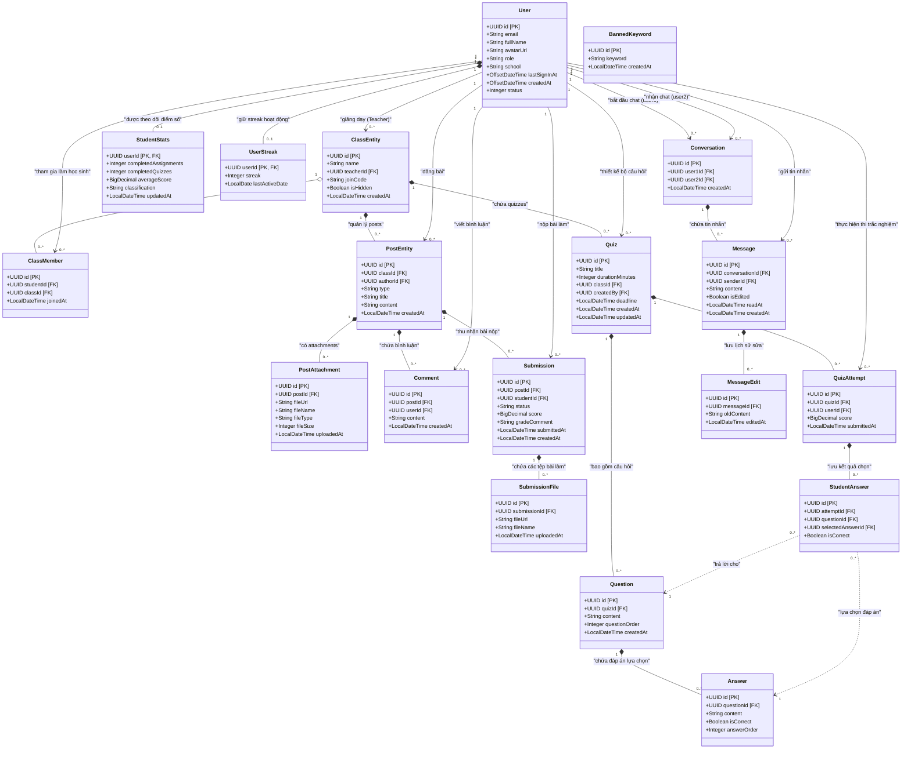

# 📊 Class Diagram — Cấu trúc thực thể (Entity Model)

Tài liệu này mô tả chi tiết sơ đồ lớp thực thể (Entity Class/ERD Diagram) của hệ thống e-learning, áp dụng chuẩn thiết kế UML với 6 loại mối quan hệ cơ bản.

---

## 1. Quy ước 6 loại mũi tên quan hệ trong sơ đồ

| Loại quan hệ | Ký hiệu trong UML / Mermaid | Ý nghĩa thực tế trong Hệ thống |
| :--- | :---: | :--- |
| **1. Kế thừa (Inheritance)** | `A --|> B` (Nét liền, tam giác rỗng) | Thể hiện mối quan hệ cha - con ("is-a"). Lớp con thừa hưởng các thuộc tính của lớp cha. |
| **2. Thực thi (Realization)** | `A ..|> B` (Nét đứt, tam giác rỗng) | Triển khai các phương thức được định nghĩa trong Interface. |
| **3. Cấu thành (Composition)** | `A *-- B` (Nét liền, hình thoi đặc ở A) | Quan hệ chứa đựng chặt chẽ (đời sống gắn liền). Nếu xóa lớp cha `A`, lớp con `B` tự động bị xóa theo (Cascade Delete). |
| **4. Kết tập (Aggregation)** | `A o-- B` (Nét liền, hình thoi rỗng ở A) | Quan hệ thu gom lỏng lẻo. Nếu xóa lớp chứa `A`, các thành phần `B` vẫn có thể tồn tại độc lập. |
| **5. Liên kết (Association)** | `A --> B` (Nét liền, mũi tên nhọn) | Mối quan hệ ngang hàng, hai thực thể biết thông tin hoặc tham chiếu đến nhau thông qua ID. |
| **6. Phụ thuộc (Dependency)** | `A ..> B` (Nét đứt, mũi tên nhọn) | Thực thể `A` sử dụng thực thể `B` tạm thời làm tham số hoặc dữ liệu tính toán. |

---

## 2. Sơ đồ Mermaid (UML Class Diagram)

Bạn có thể copy đoạn mã Mermaid dưới đây dán vào trang [Mermaid Live Editor](https://mermaid.live/) hoặc sử dụng extension Markdown Preview Mermaid trong VS Code để hiển thị sơ đồ trực quan.

---

## 3. Phân tích chi tiết các loại quan hệ áp dụng

### 3.1 Quan hệ Cấu thành (Composition - `*--`)
Trong cơ sở dữ liệu của dự án, các quan hệ cấu thành thể hiện các cặp bảng có ràng buộc khóa ngoại chặt chẽ và cơ chế `Cascade On Delete` (hoặc cấu hình Hibernate `cascade = CascadeType.ALL, orphanRemoval = true`):
* **Lớp học & Bài viết / Bộ câu hỏi:** Một bài đăng (`PostEntity`) hay một bài thi (`Quiz`) chỉ tồn tại trong ngữ cảnh của một lớp học cụ thể. Nếu lớp học bị xóa, tất cả bài viết, bình luận, và các bài kiểm tra bên trong lớp học đó sẽ bị sập/xóa bỏ hoàn toàn.
* **Bài viết & Tệp đính kèm / Bình luận:** Các tệp đính kèm bài đăng hoặc các bình luận không thể tồn tại độc lập ngoài bài đăng gốc.
* **Lượt làm bài & Đáp án học sinh:** `StudentAnswer` lưu trữ việc chọn đáp án cho một câu hỏi trong một lượt làm bài cụ thể (`QuizAttempt`). Nếu lượt thi đó bị xóa, chi tiết đáp án tương ứng cũng biến mất.

### 3.2 Quan hệ Kết tập (Aggregation - `o--`)
* **Lớp học & Thành viên:** Bảng `class_members` thu gom danh sách sinh viên tham gia lớp. Nếu một lớp học giải tán, các bản ghi liên kết trong bảng `class_members` bị xóa, tuy nhiên thực thể người dùng (`User` - sinh viên) vẫn tồn tại độc lập trong hệ thống để tham gia các lớp học khác.

### 3.3 Quan hệ Liên kết (Association - `-->`)
* **User & Các Thực thể tác vụ:** Người dùng liên kết với các thực thể qua trường ID tác giả/người thực hiện như: Giảng viên dạy lớp học (`User` -> `ClassEntity`), Người gửi tin nhắn (`User` -> `Message`), Sinh viên nộp bài tập (`User` -> `Submission`). Đây là các liên kết ngang hàng phục vụ cho việc định danh.

### 3.4 Quan hệ Phụ thuộc (Dependency - `..>`)
* **Đáp án chọn của Sinh viên với Câu hỏi/Đáp án hệ thống:** Bản ghi `StudentAnswer` lưu đáp án được học sinh chọn bằng cách trỏ tới `Question` và `Answer`. Mối quan hệ này mang tính phụ thuộc dữ liệu nhằm mục đích đối chiếu và tính điểm thi (`calculateStats`).
